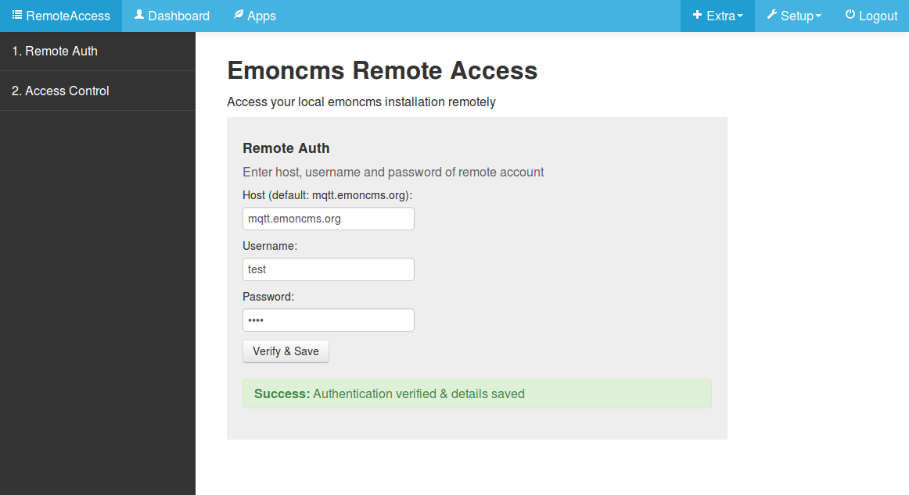
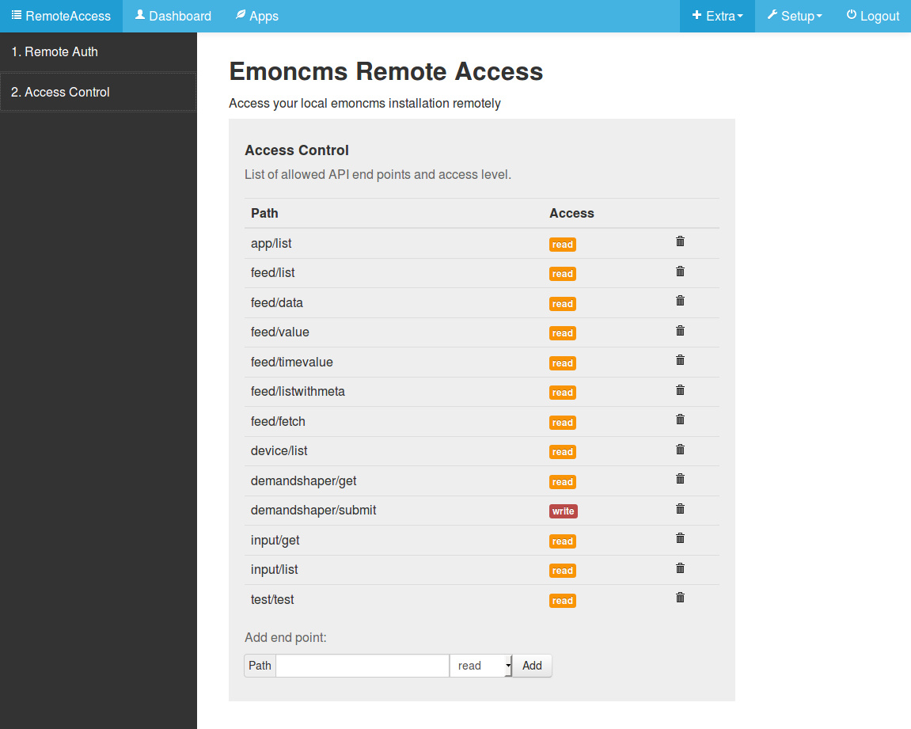
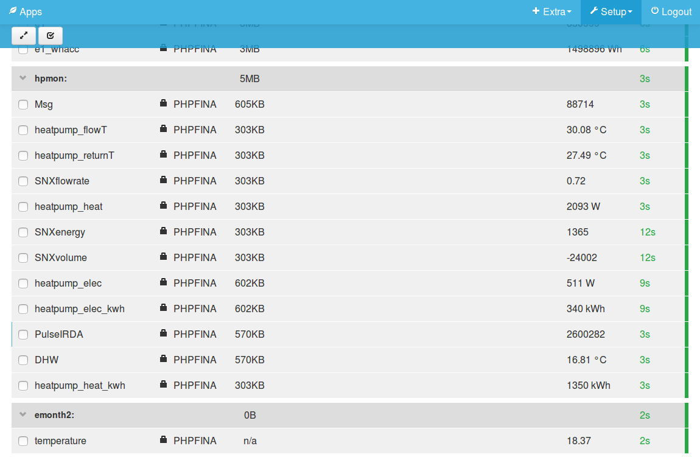

# Emoncms Remote Access (Alpha)

Background discussion: [https://community.openenergymonitor.org/t/emoncms-local-vs-remote/7268](https://community.openenergymonitor.org/t/emoncms-local-vs-remote/7268)

1. User Guide
2. Installation Guide

## User Guide

### 1. Login on mqtt.emoncms.org

Login on mqtt.emoncms.org with your emoncms.org username and password to register for the remote access service.

https://mqtt.emoncms.org
    
### 2. Configure Client

Login to the local emoncms account you wish to access remotely and navigate to the remoteaccess module in the Extra menu. Enter remote emoncms.org username and password, click verify and save to complete.

Check the access control list on the second page, make sure you are happy with the level of access. You can expand or restrict access here as needed. You may want to disable all remote write access for example or only allow remote access to read the feed list.

Login to mqtt.emoncms.org with remote emoncms account credentials to access your emonbase/emonpi remotely!

## Installation Guide

### Client Installation

Create remoteaccess.env settings file with emoncms.org username and password.

    cd ~/ 
    git clone https://github.com/emoncms/remoteaccess-client
    cd remoteaccess-client
    cp remoteaccess.json.example remoteaccess.json
    sudo chmod 666 remoteaccess.json

Install and start remoteaccess service:

    sudo ln -s /home/pi/remoteaccess-client/remoteaccess.service /lib/systemd/system
    sudo systemctl enable remoteaccess.service
    sudo systemctl start remoteaccess
    
Optional: View service log:

    journalctl -f -u remoteaccess -n 100

### Install Client Emoncms Module

    ln -s /home/pi/remoteaccess-client/remoteaccess /var/www/emoncms/Modules/remoteaccess
