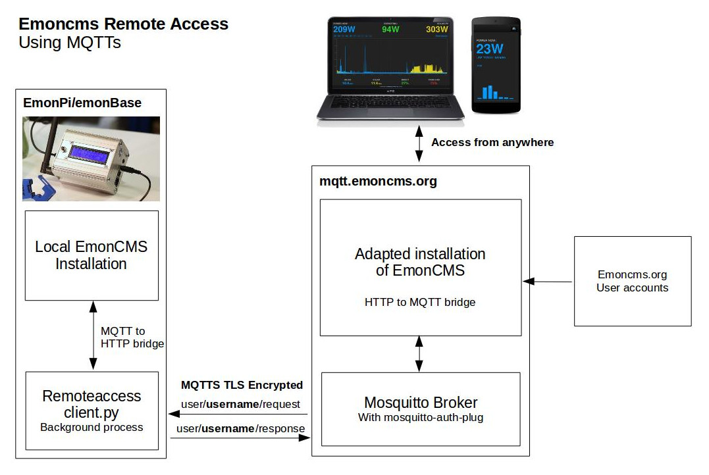

# Emoncms Remote Access (Alpha)

## How this works

A key drawback with logging data locally on an EmonPi or EmonBase is that it is harder to access data remotely while away from the home. Setting up remote access the traditional way with port forwarding is a relatively complex and can be insecure, see [guide: remote access](https://guide.openenergymonitor.org/setup/remote-access/). 

Newer services such as dataplicity are fantastic providing full SSH access as well as web view, we use them ourselves and recommend them in our guide. Dataplicity offer a single free account ideal for home users.

We wanted to see however if it would be possible to implement a minimal remote access solution where all the heavy emoncms html, css & javascript files are loaded direct from the online remote server for fast load times and the requests for data from specific local emoncms API endpoints are passed to the local emoncms installation with only the relevant emoncms data being returned.

This implementation uses MQTTS to do this: 

1. The local emoncms installation has an always running python client that connects and subscribes to a MQTT broker on the remote server - waiting for request commands. 
2. HTTP requests to the online server are translated to MQTT messages that contain the description of the request. These are published to the subscribing users request topic.
3. The local client receives the request and translates it into a HTTP request to the local emoncms HTTP api. The response is then sent back to remote server via the users response topic.
4. The remote server sends the response as a response to to the original HTTP request. This all happens in short enough time for the process to be syncronous (so far in testing).
5. The remote server web view displays the result e.g feed list or graph.

The MQTT communication is all done over TLS for security. The remote server can be accessed over HTTPS. 
The performance appears surprisingly good in testing so far.

**System Diagram**

Background discussion: [https://community.openenergymonitor.org/t/emoncms-local-vs-remote/7268](https://community.openenergymonitor.org/t/emoncms-local-vs-remote/7268)

1. User Guide
2. Installation Guide

## User Guide

### 1. Login on mqtt.emoncms.org

Login on mqtt.emoncms.org with your emoncms.org username and password to register for the remote access service.

https://mqtt.emoncms.org
    
### 2. Configure Client

Login to the local emoncms account you wish to access remotely and navigate to the remoteaccess module in the Extra menu. Enter remote emoncms.org username and password, click verify and save to complete.

Check the access control list on the second page, make sure you are happy with the level of access. You can expand or restrict access here as needed. You may want to disable all remote write access for example or only allow remote access to read the feed list.

Login to mqtt.emoncms.org with remote emoncms account credentials to access your emonbase/emonpi remotely!

## Installation Guide

### Client Installation

Create remoteaccess.env settings file with emoncms.org username and password.

    cd ~/ 
    git clone https://github.com/emoncms/remoteaccess-client
    cd remoteaccess-client
    cp remoteaccess.json.example remoteaccess.json
    sudo chmod 666 remoteaccess.json

Install and start remoteaccess service:

    sudo ln -s /home/pi/remoteaccess-client/remoteaccess.service /lib/systemd/system
    sudo systemctl enable remoteaccess.service
    sudo systemctl start remoteaccess
    
Optional: View service log:

    journalctl -f -u remoteaccess -n 100

### Install Client Emoncms Module

    ln -s /home/pi/remoteaccess-client/remoteaccess /var/www/emoncms/Modules/remoteaccess
